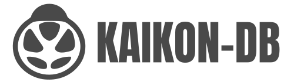

<h2>Kaikon-DB</h2>
昆虫文献・分布情報を管理できるオープンソースシステム
<h4 style="border-left:3em solid black;">はじめに</h4>
　昆虫に関する情報は、近年の研究の進展とIT技術の発達により急増し、さまざまなレベルのデータが提供されるようになってきました。これらのデータを整理・蓄積し、オープン化していくことは、研究・保全・教育といった多様な分野において重要な役割を果たすと考えられます。 
　一方で、昆虫分野には取扱いを困難にする課題もあります。ひとつめには、哺乳類や鳥類などに比べて分類の難易度が高いために信頼性の高い情報を選定していくことが欠かせません。また、情報源も、発表媒体が海外の学術誌から地方の同好会誌に至るまで非常に幅広く、情報の網羅や整理・統合には多大な労力を要します。 
　こうした課題を踏まえ、私たちはクラウド技術とオープンデータを活用し、分散していた情報を一元的に管理・整理・共有できる統合データベース「Kaikon-DB」を開発しました。誰もが自由に利用・拡張できるこのシステムが、各地域の昆虫相の解明に大きく貢献することを期待しています。
 

<h4 style="border-left:3em solid black;">本システムの特徴</h4>

<ol>
    <li>いつでも、どこでも。データを簡単検索･編集･共有</li>
インターネット経由で、必要なときに即アクセス＆更新。複数人での作業もスムーズに。
    <li>優れたUIで直感操作！ミスを防ぎ、データを守る</li>
ノートやExcelは不要。入力内容を確認しながら入力でき、意図しない変更からデータを保護。
    <li>各種レンタルサーバに対応。低コストで柔軟に設置可能 </li>
<a href="https://www.xserver.ne.jp/" target="_blank" rel="noopener noreferrer">Xserver</a>、<a href="https://lolipop.jp/" target="_blank" rel="noopener noreferrer">Lolipop</a>で動作確認済み。レガシーな技術で、幅広い環境に対応します。</ol>

<h4 style="border-left:3em solid black;">基本アーキテクチャ</h4>
本システムは、Laravelアーキテクチャに基づいています。  
  
基本的には、下記のようなLAMP環境にて動作しますが、Windows系のサーバで使用する場合には、<a href="https://www.apachefriends.org/jp/" target="_blank" rel="noopener noreferrer">XAMPP</a>などのサーバーエミュレータの動作を確認済みです。
<ul>
    <li>サーバサイドＯＳ：LHEL系LINUX</li>
    <li>ＷＥＢサーバ：Apache</li>
    <li>データベース：MySQL</li>
    <li>サーバサイドプログラム：PHP</li>
    <li>クライアントプログラム：JavaScript</li>
</ul>

<h4 style="border:1px;">インストール手順</h4>
<ol>
<li><a href="https://laravel.com/docs/12.x/installation" target="_blank" rel="noopener noreferrer">Laravelのインストール</a></li>
<li>関連パッケージのインストール</li>
    

        <pre class="notranslate"><code>composer require intervention/image
composer require laravel/breeze
php artisan breeze:install
</code></pre>
    

    
<li>設定ファイル.envの作成・修正</li>
    

    <pre class="notranslate"><code>#Linuxの場合
cp .env.example .env
#Windowsの場合
copy .env.example .env
</code></pre>
    <pre class="notranslate"><code>#.envの1行目を適宜修正する
APP_NAME=【例】山梨県の昆虫データベース
</code></pre>
    <pre class="notranslate"><code>#同2行目に挿入する
APP_NAME_EN="【例】Insect Database of Yamanashi"
LITERATURES=1
SPECIMENS=
INVENTORY=1
PHOTOS=1
</code></pre>
    <pre class="notranslate"><code>#同14行目に挿入する
ADMIN_NAME="【例】miyazaki yasuo"
ADMIN_EMAIL="【例】miyazaki.yasuo@example.com"
</code></pre>
    <pre class="notranslate"><code>#同33行目付近を適宜修正する
DB_CONNECTION=mysql
DB_HOST=127.0.0.1
DB_PORT=3306
DB_DATABASE=laravel
DB_USERNAME=root
DB_PASSWORD=
</code></pre>
    <pre class="notranslate"><code>#同40行目付近に挿入する
SESSION_EXPIRE_ON_CLOSE=true
</code></pre>
    <pre class="notranslate"><code>#同60行目付近を適宜修正する
MAIL_MAILER=smtp
MAIL_HOST=mailpit
MAIL_PORT=1025
MAIL_USERNAME=null
MAIL_PASSWORD=null
MAIL_ENCRYPTION=null
MAIL_FROM_ADDRESS="hello@example.com"
</code></pre>
    

<li>本パッケージをインストール</li>
    

    <pre class="notranslate"><code>composer require kaikon2/kaikondb
</code></pre>
    

<li>プロジェクト側 /route/web.php　のルーティング設定の無効化</li>
    

    <pre class="notranslate"><code>#6行目付近、下の記述以降をすべてコメントアウト
Route::get('/', function () {
    return view('welcome');
});
</code></pre>
    

<li>プロジェクト側へ /config,/lang,/public,/storageを設定</li>
    

    <pre class="notranslate"><code>php artisan vendor:publish --tag=kaikon-config
php artisan vendor:publish --tag=kaikon-lang
php artisan vendor:publish --tag=kaikon-public
php artisan vendor:publish --tag=kaikon-storage
</code></pre>
    

<li>マイグレーション・初期化</li>
    

    <pre class="notranslate"><code>php artisan key:generate
php artisan migrate
php artisan kaikondb:seed
php artisan kaikon:init
php artisan kaikon:queue-work
</code></pre>
    

    
<li>プロジェクト側 /storage/app/publicへのシンボリックリンク</li>
    

    <pre class="notranslate"><code>php artisan storage:link</code></pre>
    

<li>プロジェクト側 /config/kaikon.phpの修正</li>
    

    <pre class="notranslate"><code># 各設定値を入力
    'FirstMessage' => [
        'ja' => '【例】山梨の昆虫を調べよう。',
        'en' => '【例】Let’s explore Yamanashi’s insects.',
    ],
    'SubTitle' => [
        'ja' => '【例】-山梨県の昆虫総まとめプロジェクト-',
        'en' => '【例】-Yamanashi Prefecture’s Insect Biodiversity Project-',
    ],
    'OrganizationName' => [
        'ja' => '【例】かいの国昆虫ネットワーク',
        'en' => '【例】Entomorogical Network of Yamanashi, Japan',
    ],
    'ExpandedArea' => [
        'ja' => '【例】運営情報',
        'en' => '【例】Operation',
    ],
    'StartingYear' => '【例】2021',

</code></pre>
    

    
<li>プロジェクト側 /public/js/constants.js　の3行目を修正する</li>
    

    <pre class="notranslate"><code>baseUrl: 'http://localhost/',</code></pre>
    

</ol>

<h4 style="border-left:3em solid black;">その他注意点、＋α事項</h4>
<ul>
    <li>キューワーカーを起動</li>
    

    <pre class="notranslate"><code>#Linuxの場合
    cp queue_work_sample.sh queue_work.sh
    chmod 700 /path/to/queue_work.sh
    #Windowsの場合
    copy queue_work_sample.bat queue_work.bat
    </code></pre>
    <li>（これがないと認証メールが送られません）</li>
    

    <li>ファイル・フォルダのパーミッションの適切な設定</li>
    <li>/publicへのシンボリックリンク</li>
    

    <pre class="notranslate"><code>#Linuxの場合の例
ln -s /var/www/html/[project_name]/public /var/www/html/[project_open_name]
#Windowsの場合の例
mklink /D C:\inetpub\wwwroot\[project_name]\public C:\inetpub\wwwroot\[project_open_name]
</code></pre>
    

    <li>ファビコンの設定　プロジェクト側 /Public/favicon.icoを差替え</li>
</ul>
