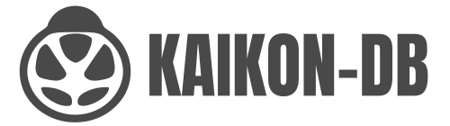

<text font-size="28">KAIKON-DB</text>
<h2>Kaikon-DB</h2>
昆虫文献・分布情報を管理できるオープンソースシステム
<h4 style="border-left:3em solid black;">はじめに</h4>
　昆虫に関する情報は、近年の昆虫界の進展とITの普及によって急速に増え、様々なレベルのデータが提供されるようになりました。データを体系的に整理・蓄積し、オープン化することは、研究、保全、教育といった幅広い分野において重要な役割を果たすことが知られています。 一方で、昆虫は他の生物群に比べて既知種の数が圧倒的に多く、毎年膨大な新種が記述されるだけでなく、分類学的な見直しも頻繁に行われている、流通している文献だけでは同定できないなど、いまだに敷居の高い群であると考えられます。また、職業研究者だけでなく多くのアマチュア研究者が新たな発見を報告しており、発表媒体も海外の著名な学術誌から地方の中小の同好会誌まで多岐に渡ります。このような中で、多様な情報を精査・整理し、統合するには大変な労力を要してきました。 
 

　しかし、この課題に関しても、IT技術の進展によって克服する環境が整いつつあります。クラウドサービスを活用することで、分散していた昆虫データを一元管理し、リアルタイムで更新することが可能となりました。また、従来は特定の機関や同好会からひっそりと発信され「知る人ぞ知る」状況であったものが、オープンデータの概念を導入し、これらの情報を広く公開・共有することで、所属を超えた協力を促すことができるようになりました。こうしたITの恩恵を受けることで、膨大な昆虫情報の整理・統合が現実的なものとなり、より広範囲での活用が可能となってきました。

　これまでも、昆虫学および関連分野では数多くのデータベースシステムが考案・開発されてきましたが、文献情報と分類・分布データを統合的に管理できるシステムは公表されていません。そこで、統合データベースシステム「Kaikon-DB」を開発し、こうしたニーズに応えるべく、必要な機能をオープンソースとして提供し、誰でも自由に利用・拡張できる環境の構築を目指しています。本システムが、各地域の昆虫相解明への大きな後押しとなることを願っています。

<h4 style="border-left:3em solid black;">本システムの特徴</h4>

<ol>
    <li>いつでも、どこでも。データを簡単検索･編集･共有</li>
インターネット経由で、必要なときに即アクセス＆更新。複数人での作業もスムーズに。
    <li>優れたUIで直感操作！ミスを防ぎ、データを守る</li>
ノートやExcelは不要。入力内容を確認しながら入力でき、意図しない変更からデータを保護。
    <li>各種レンタルサーバに対応。低コストで柔軟に設置可能 </li>
<a href="https://www.xserver.ne.jp/" target="_blank">Xserver</a>、<a href="https://lolipop.jp/" target="_blank">Lolipop</a>で動作確認済み。レガシーな技術で、幅広い環境に対応します。</ol>

<h4 style="border-left:3em solid black;">基本アーキテクチャ</h4>
本システムは、Laravelアーキテクチャに基づいています。  
  
基本的には、下記のようなLAMP環境にて動作しますが、Windows系のサーバで使用する場合には、<a href="https://www.apachefriends.org/jp/" target="_blank">XAMPP</a>などのサーバーエミュレータの動作を確認済みです。
<ul>
    <li>サーバサイドＯＳ：LHEL系LINUX</li>
    <li>ＷＥＢサーバ：LiteSpeed（Apache）</li>
    <li>データベース：MySQL</li>
    <li>サーバサイドプログラム：PHP</li>
    <li>クライアントプログラム：JavaScript</li>
</ul>

<h4 style="border:1px;">インストール手順</h4>
<ol>
<li>Laravelのインストール</li>
<li>関連パッケージのインストール</li>
    

        <pre class="notranslate"><code>composer require intervention/image
composer require laravel/breeze
php artisan breeze:install
</code></pre>
    

    
<li>設定ファイル.envの作成・修正</li>
    

    <pre class="notranslate"><code>#Linuxの場合
cp .env.example .env
#Windowsの場合
copy .env.example .env
</code></pre>
    <pre class="notranslate"><code>#.envの1行目を適宜修正する
APP_NAME=【例】山梨県の昆虫データベース
</code></pre>
    <pre class="notranslate"><code>#同2行目に挿入する
APP_NAME_EN="【例】Insect Database of Yamanashi"
LITERATURES=1
SPECIMENS=
INVENTORY=1
PHOTOS=1
</code></pre>
    <pre class="notranslate"><code>#同14行目に挿入する
ADMIN_NAME="【例】miyazaki yasuo"
ADMIN_EMAIL="【例】miyazaki.yasuo@example.com"
</code></pre>
    <pre class="notranslate"><code>#同33行目付近を適宜修正する
DB_CONNECTION=mysql
DB_HOST=127.0.0.1
DB_PORT=3306
DB_DATABASE=laravel
DB_USERNAME=root
DB_PASSWORD=
</code></pre>
    <pre class="notranslate"><code>#同60行目付近を適宜修正する
MAIL_MAILER=smtp
MAIL_HOST=mailpit
MAIL_PORT=1025
MAIL_USERNAME=null
MAIL_PASSWORD=null
MAIL_ENCRYPTION=null
MAIL_FROM_ADDRESS="hello@example.com"
</code></pre>
    

<li>本パッケージをインストール</li>
    

    <pre class="notranslate"><code>composer require kaikon2/kaikondb
</code></pre>
    

<li>プロジェクト側 /route/web.php　のルーティング設定の無効化</li>
    

    <pre class="notranslate"><code>#6行目付近、下の記述以降をすべてコメントアウト
Route::get('/', function () {
    return view('welcome');
});
</code></pre>
    

<li>プロジェクト側へ /config,/lang,/public,/storageを設定</li>
    

    <pre class="notranslate"><code>php artisan vendor:publish --tag=kaikon-config
php artisan vendor:publish --tag=kaikon-lang
php artisan vendor:publish --tag=kaikon-public
php artisan vendor:publish --tag=kaikon-storage
</code></pre>
    

<li>マイグレーション・初期化</li>
    

    <pre class="notranslate"><code>php artisan key:generate
php artisan migrate
php artisan db:seed
php artisan kaikon:init
</code></pre>
    

    
<li>プロジェクト側 /storage/app/publicへのシンボリックリンク</li>
    

    <pre class="notranslate"><code>php artisan storage:link</code></pre>
    

<li>プロジェクト側 /config/kaikon.phpの修正</li>
    

    <pre class="notranslate"><code># 各設定値を入力
    'FirstMessage' => [
        'ja' => '【例】山梨の昆虫を調べよう。',
        'en' => '【例】Let’s explore Yamanashi’s insects.',
    ],
    'SubTitle' => [
        'ja' => '【例】-山梨県の昆虫総まとめプロジェクト-',
        'en' => '【例】-Yamanashi Prefecture’s Insect Biodiversity Project-',
    ],
    'OrganizationName' => [
        'ja' => '【例】かいの国昆虫ネットワーク',
        'en' => '【例】Entomorogical Network of Yamanashi, Japan',
    ],
    'ExpandedArea' => [
        'ja' => '【例】運営情報',
        'en' => '【例】Operation',
    ],
    'StartingYear' => '【例】2021',
</code></pre>
    

</ol>

<h4 style="border-left:3em solid black;">その他注意点、＋α事項</h4>
<ul>
    <li>ファイル・フォルダのパーミッションの適切な設定</li>
    <li>/publicへのシンボリックリンク</li>
    

    <pre class="notranslate"><code>#Linuxの場合の例
ln -s /var/www/html/[project_name]/public /var/www/html/[project_open_name]
#Windowsの場合の例
mklink /D C:\inetpub\wwwroot\[project_name]\public C:\inetpub\wwwroot\[project_open_name]
</code></pre>
    

</ul>
